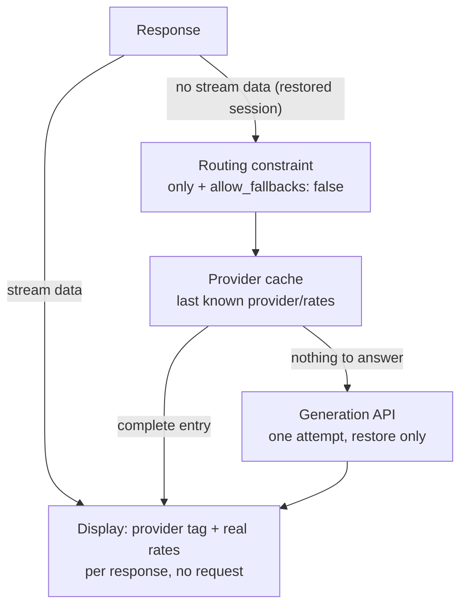
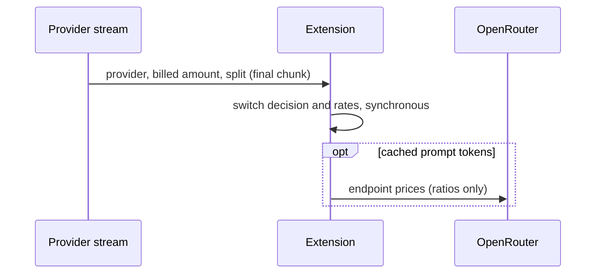

# piagent-realtime-provider-cost

<!-- badges:start -->
<!-- Generated by pi-release sync-readme from package.json; edit package.json, not this block. -->
[](https://www.npmjs.com/package/@floez-werk/piagent-realtime-provider-cost)
[](LICENSE)
[](https://github.com/FloezWerk/piagent-realtime-provider-cost/actions/workflows/ci.yml)
[](CHANGELOG.md)
<!-- badges:end -->

Shows the **effective token prices (input/output, per 1M tokens)** of the
**last API call** in the Pi status bar – right next to the session cost sum.

> **Only OpenRouter is supported today.** Real billed rates and the
> serving-provider tag come from the OpenRouter response itself (chunk metadata);
> other providers are not queried. See
> [Supported providers](#supported-providers).

Unlike the core footer's cost sum, these are the rates **actually billed by
OpenRouter** (including provider routing, discounts and peak overrides), not the
catalogue prices from `models-store.json`. For OpenRouter models the provider
**inside OpenRouter** that served the call is appended as a tag (e.g. `Fir` for
Fireworks).

```
↑$2/↓$12 (Fir)    # arrows (Unicode, full size in every font), tag = Fireworks
in:$2/out:$12     # ASCII mode (icons: ascii)
↑$1.5/↓$6 (?)     # model just switched: catalogue prices, provider not known yet
```

**Colour:** the in/out **icons** are **coloured by their deviation from the
catalogue price** (green/yellow/orange/red, see [Colours](#colours)); the numbers
and the provider tag stay in the base colour (**white**). When a **provider
switch** is detected, the **whole** item is drawn **bold gold** (`bold:#ffd700`)
for one prompt – the deviation colours do not apply then.

All values are **per 1M tokens** in the configured currency.

## Contents

- [Supported providers](#supported-providers)
- [Installation](#installation)
- [Setup](#setup)
  - [Without pi-powerline-footer](#without-pi-powerline-footer)
  - [With pi-powerline-footer (recommended)](#with-pi-powerline-footer-recommended)
- [Colours](#colours)
- [Commands](#commands)
- [Configuration](#configuration)
  - [Icons](#icons)
  - [Rounding](#rounding)
- [How it works](#how-it-works)
- [Background: where the data comes from](#background-where-the-data-comes-from)
- [Dependencies](#dependencies)
- [Changelog](#changelog)
- [License](#license)

## Supported providers

**Currently only OpenRouter is fully supported.** The real billed rate and the
serving-provider tag come from OpenRouter's response metadata; no other provider
is queried. On every other provider the item still renders, but it falls back to
Pi's catalogue computation (`usage.cost.*`) and shows **no** provider tag.

| Provider | Status | Billed rate | Serving-provider tag |
| --- | --- | --- | --- |
| **OpenRouter** (`openrouter`) | ✅ Full support | Real amount from the response (`usage.cost`, BYOK: `upstream_inference_cost`), catalogue rates only as fallback/preview | ✅ |
| Any other provider | ⚠️ Fallback only | Pi catalogue (`usage.cost.*`) – no real billed rate | ❌ |
| Subscription-backed (OAuth, `kimi-coding`) | ⛔ Hidden | – | – |

Adding another provider requires the same metadata in its stream chunks plus
per-provider price lists; see [How it works](#how-it-works).

## Installation

From npm (scoped as `@floez-werk`):

```bash
pi install npm:@floez-werk/piagent-realtime-provider-cost
```

Or directly from the repository:

```bash
pi install git:git@github.com:FloezWerk/piagent-realtime-provider-cost.git
```

> This repository is developed against a local Gitea instance and mirrored to
> the public GitHub repository `FloezWerk/piagent-realtime-provider-cost`.
> Installation instructions always reference the **GitHub** URL – the Gitea path
> is internal and must not appear in user-facing docs.

Local/development:

```bash
pi -e ./extensions/realtime-provider-cost.ts
```

After changes in a running session: `/reload`.

Afterwards the extension is active immediately – **without further
configuration** the value appears in the footer next to the cost sum. If you use
the Powerline bar, the item should additionally be hooked in there (next
section).

## Setup

### Without pi-powerline-footer

Works standalone: `ctx.ui.setStatus` is a core API, the core footer shows the
value as its own line below the status line.

### With pi-powerline-footer (recommended)

Add a custom item that reads the `realtime-provider-cost` status channel:

```jsonc
{
  "powerline": {
    "preset": "default",
    "customItems": [
      {
        "id": "provider-cost",
        "statusKey": "realtime-provider-cost",
        "position": "right",
        "color": "warning",
        "selfColorize": true,
        "hideWhenMissing": true,
        "excludeFromExtensionStatuses": true
      }
    ]
  }
}
```

Explicit positioning right next to `cost` via `powerline.layout`:

```jsonc
{
  "powerline": {
    "layout": {
      "left": ["model", "thinking", "shell_mode", "path", "git", "queue", "context_pct", "cache_read", "cost", "custom:provider-cost"]
    },
    "customItems": [
      { "id": "provider-cost", "statusKey": "realtime-provider-cost", "selfColorize": true }
    ]
  }
}
```

> **Important:** set `selfColorize: true`. Otherwise Powerline strips the item's
> ANSI colour codes and colours it itself – the dynamic white/gold switch on a
> provider change would be lost.

## Colours

Two layers, set via `/provider-cost` or the settings:

1. **Deviation colouring** – the effective rate is compared with the model's
   **catalogue price** (`models-store.json`). The **icons** carry the colour (in
   and out separately); the numbers and the provider tag stay in the base colour,
   which keeps them readable on dark backgrounds.

   | Deviation from catalogue price | Colour |
   | --- | --- |
   | more than `green` % cheaper (default > 10 %) | **green** |
   | up to `yellow` % more expensive (default ≤ 10 %) | **yellow** |
   | up to `orange` % more expensive (default ≤ 20 %) | **orange** (256-colour 208) |
   | above `orange` % | **red** |
   | 0 %, less than `green` % cheaper, or no catalogue price | base colour |

   Thresholds via `deviationThresholds` or
   `/provider-cost threshold <green|yellow|orange> <pct>`. Compared at the
   **displayed precision** (4 decimals in the display currency), so a rate that
   renders like the catalogue price keeps the base colour – that swallows the
   binary-float noise of the invoice-derived rates. `deviationStyle` /
   `/provider-cost style` adds SGR attributes to the icon: `plain` (default),
   `bold`, `reverse`.

2. **Base/switch colour** – `color` (default `white`) for everything else;
   `switchColor` (default `bold:#ffd700`) paints the **whole** item when a
   **provider switch** is detected, for one prompt, overriding the deviation
   colours.

Specs: palette (`white`, `yellow`, `orange`, `red`, `green`, `cyan`, `magenta`,
`blue`, `gray`, `none`), hex (`#ffd700`, `#fd0`), 256-colour (`226`), with
attributes (`bold:…`, `reverse:…`, combinable: `bold:reverse:red`). These are
ANSI specs, not CSS or Pi/Powerline theme names (`warning`, `error`, …): the
extension colours its own text so the switch can be dynamic – inside
pi-powerline-footer that needs `selfColorize: true` (see [Setup](#setup)).

## Commands

| Command | Effect |
| --- | --- |
| `/provider-cost` or `/provider-cost status` | State, currency, icons, colours, lookup state, display, tag/source, cache entry |
| `/provider-cost on` | Enable the display (persisted) |
| `/provider-cost off` | Disable the display (persisted) |
| `/provider-cost toggle` | Toggle (persisted) |
| `/provider-cost refresh` | Reload exchange rates **and** re-resolve provider/costs of the last call |
| `/provider-cost currency <CODE>` | Set the display currency (persisted) |
| `/provider-cost icons <auto\|nerd\|ascii>` | Set the icon mode (persisted) |
| `/provider-cost color <spec>` | Set the base colour, e.g. `white`, `#ffd700`, `226`, `bold:yellow` (persisted, see [Colours](#colours)) |
| `/provider-cost switchColor <spec>` | Set the switch colour (provider change) (persisted, see [Colours](#colours)) |
| `/provider-cost style <plain\|bold\|reverse>` | Attributes of the deviation colour on the in/out icon (persisted; default `plain`) |
| `/provider-cost threshold <green\|yellow\|orange> <pct>` | Set a deviation threshold in percent (persisted; defaults 10/10/20) |
| `/provider-cost lookup <on\|off\|refresh>` | Provider resolution on/off; `refresh` clears the provider **and** pricing cache and re-resolves |

## Configuration

In `~/.pi/agent/settings.json` under the root key `realtime-provider-cost`
(matching the extension name). Other keys are left untouched; every value can
also be set via a command.

```jsonc
{
  "realtime-provider-cost": {
    "enabled": true,
    "currency": "EUR",
    "icons": "nerd",
    "color": "white",
    "switchColor": "bold:#ffd700",
    "deviationStyle": "plain",
    "deviationThresholds": { "green": 10, "yellow": 10, "orange": 20 },
    "lookupUpstreamProvider": true
  }
}
```

| Field | Default | Description |
| --- | --- | --- |
| `enabled` | `true` | Display on/off |
| `currency` | `"USD"` | `USD`, `CNY`, `EUR`, `GBP`, `JPY`, `CAD`, `AUD`, `CHF`, `INR`, `KRW` |
| `icons` | `"auto"` | `auto` (terminal heuristic), `nerd`, `ascii` – `nerd`/`auto` use `↑`/`↓`, `ascii` uses `in:`/`out:` |
| `color` | `"white"` | Base colour: palette name, `#rrggbb` or `0-255`, optionally with `bold:` |
| `switchColor` | `"bold:#ffd700"` | Colour right after a detected provider change |
| `deviationStyle` | `"plain"` | SGR attributes of the deviation colour on the icon: `plain`, `bold`, `reverse` |
| `deviationThresholds` | `{green:10, yellow:10, orange:20}` | Percentage thresholds: below `-green` green, up to `yellow` yellow, up to `orange` orange, above red (all ≥ 0) |
| `lookupUpstreamProvider` | `true` | Resolve the serving provider and the real prices (response stream, routing constraint, cache, generation API for a restored session). `off` = catalogue prices, no provider tag |

### Icons

1. Env `PROVIDER_COST_NERD_FONTS=1` (nerd) / `=0` (ascii)
2. Config `icons`
3. `auto`: heuristic like Powerline (`GHOSTTY_RESOURCES_DIR` or
   `TERM_PROGRAM`/`TERM` ∈ iterm, wezterm, kitty, ghostty, alacritty, kaku)

Many terminals only set `TERM=xterm-256color` → `auto` yields ASCII
(`in:`/`out:`); for icons use `icons: "nerd"` or `/provider-cost icons nerd`.

> The previously used Nerd Font arrows (`U+F090`/`U+F08B`) were replaced by
> `↑`/`↓` because private-use glyphs are rendered noticeably smaller.

### Rounding

Rounded to **at most 4 decimal places**, trailing zeros removed (`$2`, `$12.5`,
`$0.2896`).

## How it works

The numbers come from the **response itself**, not from a price list: OpenRouter
puts the serving provider into every stream chunk and the billed amount with its
prompt/completion split into the final usage chunk. Pi drops both while
normalizing - `provider_stream_event` (pi 0.99+) hands them over before that, so
provider and prices are known **per response**, without a request.



**Rates from the invoice.** The billed amount arrives split into its prompt and
completion part (`usage.cost_details.*`), so the rates are exact:

```
out-rate = completions_cost / completion_tokens            (USD per 1M tokens)
in-rate  = prompt_cost / (in + wWrite*cacheWrite + wRead*cacheRead)
```

`prompt_cost` covers **every** prompt token, so cached tokens are weighted by
their price *relation* to the input price (`wRead`/`wWrite`, from the endpoint
prices). Without cached prompt tokens nothing has to be looked up:



Without such a split (restore, generation API) the billed total is split by the
provider's endpoint prices instead: `factor = billed / modelled`,
`rate = price * factor`. Those prices are used at the **long-context tier** that
applies to the call (`pricing.overrides`), and every billed bucket counts -
including the cached prompt tokens, which OpenRouter reports outside `input`.

**Details**

- **BYOK** (request served through your own provider key): OpenRouter charges
  nothing and the provider invoices you directly, so the upstream amount is used -
  never `$0/$0`.
- **Routing constraint** (`models.json` →
  `providers.openrouter.modelOverrides.<model>.compat.openRouterRouting.only`):
  counts as *certain* only with `allow_fallbacks: false` - otherwise another
  provider may serve even a single `only` entry.
- **Generation API** (`/api/v1/generation?id=<responseId>`): **restore-only** -
  one attempt, only when the cache has nothing to answer with (it covers one
  response at a time). Live calls, model switches and aborted streams never
  trigger it; a failed lookup keeps the last known values.
- **Caches**: `provider-cache.json` (provider + rates per model; every response
  overwrites its entry, so nothing expires) and `endpoint-pricing.json` (provider
  price lists, 24 h). `/provider-cost lookup refresh` clears both.
- **Model switch**: the catalogue prices of the new model appear immediately with
  a `?` tag until its first response replaces them.
- **Update timing**: the item changes on `message_end` only, when the final chunk
  has been seen - while streaming the last known value stays.
- **Not computable** (e.g. `usage.input == 0`, missing exchange rate) → `?` per
  side; **free models** → `$0/$0`; **subscription providers** → item hidden.
- **Currency** mirrors `pi-powerline-footer` (same source, 24 h cache, own file);
  the session cost sum next to it stays Pi's own catalogue value.
- **Background work**: a resolution runs in the background and stops rendering
  once the session is gone, so it can never affect a run (`pi -p` included).

## Background: where the data comes from

OpenRouter delivers the provider that served the request in the stream chunk as a
`provider` field and the amount it charged in the final usage chunk. Pi
(`pi-ai`) drops both while normalizing: it reads only `chunk.id` and `chunk.model`
from a chunk, and computes costs from its own price table (`models-store.json`),
which reflects the **model base price**, not the price of the routed provider
(example `deepseek/deepseek-v4.1-flash` via Fireworks: catalogue 0.15/0.60 vs.
real 0.22/0.66). No provider header exists either (`X-Provider-Name` is only
listed as "exposed" but is not sent).

Since pi 0.99 the raw chunk is reachable before normalization through the
`provider_stream_event` extension event, which is what this extension uses. The
[generation API](https://openrouter.ai/docs/api/api-reference/generations/get-request-&-usage-metadata-for-a-generation)
is kept for the one case without stream data - the last call of a **restored
session**; it needs a separate request, is published with a delay of up to a
minute and returns the same provider and amount.

## Dependencies

`@earendil-works/pi-ai`, `@earendil-works/pi-coding-agent` and
`@earendil-works/pi-tui` are bundled by Pi and are therefore only declared as
optional `peerDependencies`. No runtime dependencies on other extensions.

## Changelog

User-facing changes per version are tracked in [CHANGELOG.md](./CHANGELOG.md)
(Keep a Changelog format).

<!-- changelog:start -->
<!-- Generated by pi-release sync-readme-changelog; edit CHANGELOG.md, not this block. -->
**0.12.1 - 2026-09-20**

### Added

- The README now states up front that only OpenRouter is supported, with a
  [Supported providers](./README.md#supported-providers) table that lists the
  current status per provider (OpenRouter: full support; other providers:
  catalogue fallback without provider tag; subscriptions: hidden).

Full history and all versions: [CHANGELOG.md](./CHANGELOG.md)
<!-- changelog:end -->

## License

[MIT](./LICENSE) – see [`LICENSE`](./LICENSE).
